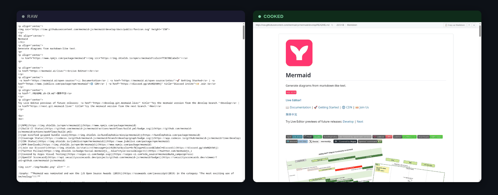

# cooked



A rendering proxy for air-gapped environments. Give it a raw document URL and it serves styled HTML. The binary is fully self-contained — all CSS, JavaScript, and templates are embedded. No CDN requests, no external resources.

## How it works

```
https://cooked.example.com/https://cgit.internal/repo/plain/README.md
```

cooked fetches the upstream URL, detects the file type, renders it to styled HTML, and returns it. That's it.

## Supported formats

- **Markdown** — `.md`, `.markdown`, `.mdown`, `.mkd`
- **MDX** — `.mdx` (JSX imports/exports and component tags are stripped before rendering)
- **AsciiDoc** — `.adoc`, `.asciidoc`, `.asc` (rendered via [libasciidoc](https://github.com/bytesparadise/libasciidoc); `include::` directives are skipped for remote documents)
- **Org-mode** — `.org` (rendered via [go-org](https://github.com/niklasfasching/go-org); title extracted from `#+TITLE` or first headline)
- **Code** — 30+ languages including Go, Python, Rust, TypeScript, Java, C/C++, Ruby, Shell, SQL, HCL, and more (plus `Dockerfile`, `Makefile`, `Jenkinsfile` by filename)
- **Plaintext** — `.txt`, `.text`, `.log`, `.conf`, `.cfg`, `.ini`, `.env`

## Quick start

```bash
make deps    # Download embedded assets (mermaid.js, github-markdown-css)
make build   # Build the binary
./cooked     # Start on :8080
```

## Configuration

| Flag | Env Var | Default | Description |
|------|---------|---------|-------------|
| `--listen` | `COOKED_LISTEN` | `127.0.0.1:8080` | Listen address (loopback only by default; Docker overrides to `0.0.0.0:8080`) |
| `--cache-ttl` | `COOKED_CACHE_TTL` | `5m` | Cache TTL duration |
| `--cache-max-size` | `COOKED_CACHE_MAX_SIZE` | `100MB` | Max cache size (e.g. 100MB) |
| `--fetch-timeout` | `COOKED_FETCH_TIMEOUT` | `30s` | Upstream fetch timeout |
| `--max-file-size` | `COOKED_MAX_FILE_SIZE` | `5MB` | Max file size to render (e.g. 5MB) |
| `--allowed-upstreams` | `COOKED_ALLOWED_UPSTREAMS` | *(empty)* | Comma-separated allowed upstreams: hostnames, `*.wildcard`, or CIDR ranges |
| `--base-url` | `COOKED_BASE_URL` | *(auto-detect)* | Public base URL of cooked |
| `--default-theme` | `COOKED_DEFAULT_THEME` | `auto` | Default theme: auto, light, or dark |
| `--tls-skip-verify` | `COOKED_TLS_SKIP_VERIFY` | `false` | Disable TLS certificate verification for upstream fetches |

## Security

### Allowed upstreams

The `--allowed-upstreams` flag restricts which upstream hosts cooked will fetch from. It accepts a comma-separated list of three entry types:

- **Hostnames** — exact match plus subdomain matching (e.g. `cgit.internal` also allows `sub.cgit.internal`)
- **Wildcards** — `*.internal` matches any host ending in `.internal` (e.g. `foo.internal`, `a.b.internal`)
- **CIDR ranges** — `10.0.0.0/8` matches IP-literal URLs in that range (e.g. `http://10.0.1.50/file.md`)

Redirect targets are also validated against the allowlist.

```bash
./cooked --allowed-upstreams="*.internal,10.0.0.0/8,gitea.specific.host"
```

### Private IP protection (SSRF)

When `--allowed-upstreams` is **not set**, cooked blocks requests to private and loopback IP ranges to prevent server-side request forgery (SSRF). The blocked ranges include:

- IPv4/IPv6 loopback, private (RFC 1918), link-local, multicast, unspecified
- CGNAT (`100.64.0.0/10`)

When `--allowed-upstreams` **is set**, the allowlist becomes the trust boundary and private-IP blocking is disabled. This is required for air-gapped environments where upstreams are on private networks (10.x, 172.16.x, 192.168.x).

Redirects are capped at 5 hops and validated against the allowlist when set.

### HTML sanitization

Rendered markup output (Markdown, MDX, AsciiDoc, Org-mode) is sanitized: `<script>`, `<iframe>`, `<object>`, `<embed>`, `<form>`, `<input>` tags and all `on*` event handler attributes are stripped. Additionally, `javascript:`, `vbscript:`, and `data:text/html` URIs in `href`/`src` attributes are removed.

### TLS verification

By default, cooked verifies TLS certificates when fetching upstream URLs. For internal CAs, add your CA certificate to the system trust store (see [Docker with internal CAs](#internal-ca-certificates)). Use `--tls-skip-verify` only as a last resort.

### No credential forwarding

cooked does not forward cookies, authorization headers, or other credentials to upstream servers.

## Docker

```bash
docker run -p 8080:8080 ghcr.io/air-gapped/cooked:latest
docker run -p 8080:8080 ghcr.io/air-gapped/cooked:latest --allowed-upstreams="*.internal,10.0.0.0/8"
```

### Image verification

Container images are signed with [cosign](https://github.com/sigstore/cosign) keyless signing and include an SPDX SBOM attestation.

```bash
# Verify image signature
cosign verify ghcr.io/air-gapped/cooked:latest \
  --certificate-oidc-issuer https://token.actions.githubusercontent.com \
  --certificate-identity-regexp github.com/air-gapped/cooked

# Verify SBOM attestation
cosign verify-attestation ghcr.io/air-gapped/cooked:latest \
  --type spdxjson \
  --certificate-oidc-issuer https://token.actions.githubusercontent.com \
  --certificate-identity-regexp github.com/air-gapped/cooked
```

### Internal CA certificates

If your upstreams use certificates signed by an internal CA, add the CA cert to the image:

```dockerfile
FROM ghcr.io/air-gapped/cooked:latest
COPY my-internal-ca.crt /usr/local/share/ca-certificates/
RUN update-ca-certificates
```

#### Runtime injection (Kubernetes)

If your CA certificates are distributed at runtime (e.g. by [trust-manager](https://cert-manager.io/docs/trust/trust-manager/)), mount them into `/usr/local/share/ca-certificates/`. cooked runs `update-ca-certificates` at startup before the Go process begins, so any `.crt` files in that directory are picked up automatically.

```yaml
volumeMounts:
- name: internal-ca
  mountPath: /usr/local/share/ca-certificates/internal-ca.crt
  subPath: ca-certificates.crt    # key name from your trust-manager Bundle
volumes:
- name: internal-ca
  configMap:
    name: my-ca-bundle            # created by trust-manager
```

> **Important:**
> - Files **must** have a `.crt` extension — `.pem` files are silently ignored by `update-ca-certificates`.
> - Use `subPath` to mount individual files. Mounting the entire ConfigMap as a directory replaces all existing contents.
> - `/etc/ssl/certs/` must be writable. If using `readOnlyRootFilesystem: true`, add an `emptyDir` volume on `/etc/ssl/certs`.

### Docker Compose

```yaml
services:
  cooked:
    image: ghcr.io/air-gapped/cooked:latest
    ports:
      - "8080:8080"
    command: ["--allowed-upstreams=*.internal,10.0.0.0/8,gitea.corp.example.com"]
```

## Special paths

| Path | Description |
|------|-------------|
| `GET /` | Landing page with URL input field |
| `GET /healthz` | Health check (200 OK) |
| `GET /_cooked/docs` | Embedded project documentation |
| `GET /_cooked/raw/{url}` | Raw proxy — fetches upstream content without rendering. Used internally to proxy images and assets so the browser doesn't need direct access to the upstream. Subject to allowlist and SSRF protections. |
| `GET /_cooked/{path}` | Embedded assets (mermaid.min.js, CSS) |
| `GET /{upstream_url}` | Main render endpoint — fetches, renders, and returns styled HTML |

## Response headers

cooked sets response headers for monitoring and debugging:

| Header | Description |
|--------|-------------|
| `X-Cooked-Version` | Application version |
| `X-Cooked-Upstream` | Upstream URL that was fetched |
| `X-Cooked-Upstream-Status` | HTTP status code from upstream |
| `X-Cooked-Cache` | Cache status (hit/miss/revalidated/stale) |
| `X-Cooked-Content-Type` | Detected file type (markdown/mdx/asciidoc/org/code/plaintext) |
| `X-Cooked-Render-Ms` | Time spent rendering HTML (milliseconds) |
| `X-Cooked-Upstream-Ms` | Time spent fetching from upstream (milliseconds) |

## Health check

`GET /healthz` returns `200 OK`. Use this for load balancer and container health checks.

## Development

```bash
make help    # Show all available targets
make deps    # Download embedded assets
make build   # Build the binary
make test    # Run tests
make lint    # Run golangci-lint + gitleaks
make docker  # Build Docker image
```

## License

[MIT](LICENSE)
