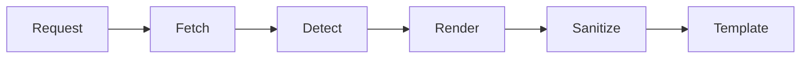

# cooked

A rendering proxy that fetches raw document URLs and serves them as styled,
self-contained HTML pages.

## Features

- **Markdown rendering** with GFM support (tables, task lists, strikethrough)
- **Syntax highlighting** for 30+ languages via [Chroma](https://github.com/alecthomas/chroma)
- **Mermaid diagrams** rendered client-side
- ~~Legacy plaintext mode~~ (replaced by auto-detection)

## Quick Start

### Prerequisites

- Go 1.24+
- Make

### Install

```bash
git clone https://github.com/example/cooked.git
cd cooked
make build
```

### Run

```bash
./cooked --port 8080
```

Then visit: https://localhost:8080/https://example.com/README.md

## Architecture



## Configuration

| Flag          | Env Var          | Default | Description            |
|---------------|------------------|---------|------------------------|
| `--port`      | `COOKED_PORT`    | 8080    | HTTP listen port       |
| `--timeout`   | `COOKED_TIMEOUT` | 30s     | Upstream fetch timeout |
| `--cache-ttl` | `COOKED_TTL`     | 5m      | Cache duration         |

## Roadmap

- [x] Markdown rendering
- [x] Code highlighting
- [x] Mermaid support
- [ ] PDF rendering
- [ ] Image gallery mode

## API

### `GET /healthz`

Returns `200 OK` if the server is healthy.

### `GET /{upstream_url}`

Fetches and renders the upstream document.

**Response headers:**

| Header          | Description                 |
|-----------------|-----------------------------|
| `X-Cache`       | `HIT` or `MISS`            |
| `X-Render-Time` | Rendering duration          |

## Footnotes

The name "cooked" refers to the idea of "cooking" raw content[^1].

[^1]: As opposed to serving it "raw".

## License

MIT
