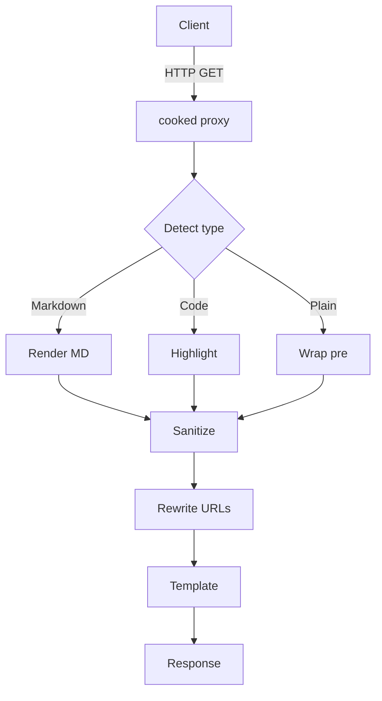
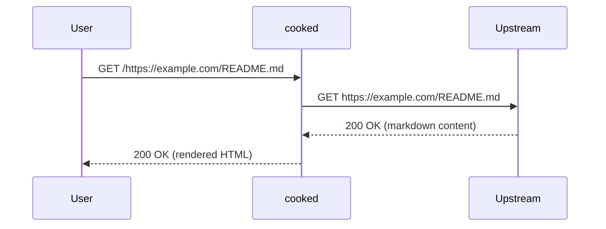

# Architecture Overview

Below is the request flow:


```mermaid
graph TD
    A[Client] -->|HTTP GET| B[cooked proxy]
    B --> C{Detect type}
    C -->|Markdown| D[Render MD]
    C -->|Code| E[Highlight]
    C -->|Plain| F[Wrap pre]
    D --> G[Sanitize]
    E --> G
    F --> G
    G --> H[Rewrite URLs]
    H --> I[Template]
    I --> J[Response]
```

## Sequence Diagram


```mermaid
sequenceDiagram
    participant U as User
    participant C as cooked
    participant S as Upstream
    U->>C: GET /https://example.com/README.md
    C->>S: GET https://example.com/README.md
    S-->>C: 200 OK (markdown content)
    C-->>U: 200 OK (rendered HTML)
```

Regular code blocks should not be treated as mermaid:

```go
func main() {
    fmt.Println("not mermaid")
}
```
